```mermaid
sequenceDiagram
    autonumber
    participant Remote as Remote UI
    participant Server as WebSocket Server
    participant Offscreen as offscreen.js
    participant Background as background.js
    participant Content as content.js

    %% Host Registration
    Offscreen->>Server: REGISTER_HOST
    Server-->>Offscreen: HOST_REGISTERED (SESSION_IDENTITY)
    Offscreen->>Background: Store SESSION_IDENTITY

    %% Remote Pairing
    Remote->>Server: JOIN_PAIR (SESSION_IDENTITY)
    Server-->>Remote: PAIR_JOINED (remoteId)
    Server-->>Offscreen: REMOTE_JOINED (remoteId)
    Offscreen->>Background: Remote connected

    %% Media Tab Discovery
    Background->>Background: Query open tabs
    Background->>Offscreen: MEDIA_TABS_LIST (remoteId, tabs)
    Offscreen->>Server: MEDIA_TABS_LIST
    Server-->>Remote: MEDIA_TABS_LIST

    %% Remote Selects Active Tab
    Remote->>Server: SELECT_ACTIVE_TAB (tabId)
    Server->>Offscreen: SELECT_ACTIVE_TAB
    Offscreen->>Background: SELECT_ACTIVE_TAB
    Background->>Background: Map remoteId → tabId

    %% Playback Control
    Remote->>Server: CONTROL_EVENT (TOGGLE_PLAYBACK)
    Server->>Offscreen: CONTROL_EVENT
    Offscreen->>Background: CONTROL_EVENT
    Background->>Content: TOGGLE_PLAYBACK

    %% Playback State Update
    Content-->>Background: STATE_UPDATE (PLAYING / PAUSED)
    Background->>Offscreen: STATE_UPDATE
    Offscreen->>Server: STATE_UPDATE
    Server-->>Remote: STATE_UPDATE

```

# 🎮 Media Remote Control

Control media playback on your desktop browser **remotely** using a remote device with secure, real-time WebSocket connection.

This project allows you to:
- Pair a **browser extension (host)** with a **remote device**
- Discover active media tabs (YouTube, Netflix, Prime Video, etc.)
- Remotely **Play / Pause** media with low latency
- Maintain session security, rate-limits, and scoped routing

> Built using **Chrome Extensions (MV3)**, **WebSockets**, **React**, and **Node.js**

---

## ✨ Features

- 🔗 Secure session-based pairing (Host ↔ Remote)
- 📡 Persistent WebSocket connection using MV3 offscreen documents
- 🎥 Smart media discovery & playback state tracking
- ⚡ Low-latency control events
- 🧠 Stateless remotes, authoritative host
- 🧩 Modular protocol-driven architecture

---

## 1. Project Structure
```
└── 📁media-remote-control
    └── 📁client
        └── 📁src
    └── 📁extension
        └── 📁libs
        ├── background.js
        ├── content.js
        ├── offscreen.js
        ├── popup.js
    └── 📁server
        ├── constants.js
        ├── index.js
    └── readme.md
```
----

## 2. Components Overview

- **Extension**: Owns browser state and media control
- **Server**: Manages sessions and message routing
- **Remote UI**: Displays tabs and sends control actions

---
## 3. Architecture flow


----



---

## 4. Open Source Contributions 🤝

- **We welcome contributors.**
- **You can help by:**
    - **Extending controls for browser**
    - **Adding new media platforms**
    - **Improving protocol validation**
    - **Enhancing UI/UX**
    - **Adding tests**
    - **Improving docs**

> Whether you're fixing bugs, adding features, or improving documentation, your help is highly appreciated ❤️.

---